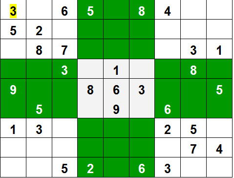

# Backtracking Algorithm
Backtracking can be defined as a general algorithmic technique that considers searching every possible combination in order to solve a computational problem.

Backtracking is an algorithmic technique for solving problems recursively by trying to build a solution incrementally, one piece at a time, removing those solutions that fail to satisfy the constraints of the problem at any point of time (by time, here, is referred to the time elapsed till reaching any level of the search tree).


### 1. Algorithm Overview

#### 1.1 Description

Backtracking is a recursive algorithm that explores all possible solutions to a problem by constructing candidates incrementally and abandoning a candidate ("backtracking") if it is determined to be invalid.

#### 1.2 Purpose

The purpose of the algorithm is to find one or all solutions to a problem by systematically exploring the solution space and avoiding unnecessary searches.

### 2. Pseudocode

Provide pseudocode that outlines the steps of the backtracking algorithm.

```plaintext
procedure Backtracking(problem, partial_solution):
    if partial_solution is a valid solution:
        report(partial_solution)
    for each candidate in generate_candidates(problem, partial_solution):
        if candidate is a valid choice:
            add candidate to partial_solution
            Backtracking(problem, partial_solution)
            remove candidate from partial_solution
```

### 3. Types of Backtracking Algorithm
There are three types of problems in backtracking
1. Decision Problem – In this, we search for a feasible solution.
2. Optimization Problem – In this, we search for the best solution.
3. Enumeration Problem – In this, we find all feasible solutions.

### 4. When can be Backtracking Algorithm used?
For example, consider the SudoKo solving Problem, we try filling digits one by one. Whenever we find that current digit cannot lead to a solution, we remove it (backtrack) and try next digit. This is better than naive approach (generating all possible combinations of digits and then trying every combination one by one) as it drops a set of permutations whenever it backtracks.


### 5. Time Complexity

The time complexity of a backtracking algorithm depends on the number of candidate solutions explored and the time it takes to check if a candidate is a valid solution or to generate valid candidates. The time complexity is often expressed in Big O notation, indicating the upper bound on the growth rate of the algorithm's time requirements relative to the input size.

For backtracking algorithms, the time complexity is commonly represented as O(b^d), where:

- **b** is the branching factor: the number of choices for each decision point.
- **d** is the depth of the recursion: the maximum depth of the recursion tree.

The exponential time complexity reflects the fact that the algorithm explores all possible combinations of choices in the solution space.

### Example:

Consider the N-Queens problem, where you need to place N queens on an N×N chessboard in such a way that no two queens attack each other. In this case:

- **b** is the number of possible choices for placing a queen in a row (N choices in the first row, N-1 in the second, and so on).
- **d** is the number of rows (N).

The time complexity would be O(N!), where N! (N factorial) accounts for the factorial growth due to the branching factor.

### Summary:

- The time complexity of backtracking algorithms can be high, especially for problems with large solution spaces.
- The branching factor and recursion depth play a crucial role in determining the time complexity.
- Some optimizations, pruning techniques, and heuristics can be applied to reduce the search space and improve the overall efficiency of backtracking algorithms.

Example:
- O(b^d), where b is the branching factor and d is the depth of the recursion.

### 6. Space Complexity

The space complexity of a backtracking algorithm is determined by the amount of memory or storage required during its execution. It is often expressed in Big O notation, representing the upper bound on the growth rate of the algorithm's space requirements concerning the input size.

The space complexity of a backtracking algorithm is typically associated with the depth of the recursion, as each recursive call consumes additional memory on the call stack. The space complexity is commonly expressed as O(d), where d is the maximum depth of the recursion.

Let's break down the factors influencing the space complexity:

1. **Recursive Call Stack:**
    - The primary contributor to space complexity is the call stack used for recursive function calls.
    - Each recursive call consumes space on the stack to store local variables, function parameters, and the return address.

2. **Data Structures:**
    - The use of additional data structures, such as arrays or lists, to store partial solutions or intermediate results during the backtracking process can also contribute to space complexity.
    - The size of these data structures and how they grow with the input size impact the overall space requirements.

3. **Branching Factor:**
    - While the branching factor (b) influences time complexity, it does not directly contribute to space complexity in the same way. The space complexity is more closely tied to the depth of the recursion.

### Example:

Consider a backtracking algorithm solving the N-Queens problem:

- The space complexity would be O(N) as it depends on the depth of the recursion (number of rows in the chessboard).
- The recursive call stack depth is equal to the number of rows where decisions are made (placing queens), which is N.

### Summary:

- The space complexity of backtracking algorithms is often dominated by the depth of the recursion.
- The use of additional data structures can contribute to space requirements.
- The branching factor (number of choices at each decision point) primarily affects time complexity, not space complexity.

Example:
- O(d), where d is the maximum depth of the recursion.

### 7. Implementation

Certainly! Below is a simple implementation of the Sudoku solving algorithm in Java using the backtracking approach. This program attempts to solve a given Sudoku puzzle. If a solution exists, it prints the solved Sudoku board; otherwise, it indicates that no solution was found.

```java
public class SudokuSolver {

    public static void main(String[] args) {
        int[][] sudokuBoard = {
            {5, 3, 0, 0, 7, 0, 0, 0, 0},
            {6, 0, 0, 1, 9, 5, 0, 0, 0},
            {0, 9, 8, 0, 0, 0, 0, 6, 0},
            {8, 0, 0, 0, 6, 0, 0, 0, 3},
            {4, 0, 0, 8, 0, 3, 0, 0, 1},
            {7, 0, 0, 0, 2, 0, 0, 0, 6},
            {0, 6, 0, 0, 0, 0, 2, 8, 0},
            {0, 0, 0, 4, 1, 9, 0, 0, 5},
            {0, 0, 0, 0, 8, 0, 0, 7, 9}
        };

        if (solveSudoku(sudokuBoard)) {
            System.out.println("Sudoku solved successfully:");
            printSudoku(sudokuBoard);
        } else {
            System.out.println("No solution exists for the given Sudoku puzzle.");
        }
    }

    // Solves the Sudoku puzzle using backtracking
    private static boolean solveSudoku(int[][] board) {
        int[] emptyCell = findEmptyCell(board);
        int row, col;

        if (emptyCell == null) {
            // All cells are filled, puzzle is solved
            return true;
        }

        row = emptyCell[0];
        col = emptyCell[1];

        for (int num = 1; num <= 9; num++) {
            if (isValidMove(board, row, col, num)) {
                board[row][col] = num;

                if (solveSudoku(board)) {
                    return true; // Recursive call successful, puzzle is solved
                }

                // If the current move doesn't lead to a solution, backtrack
                board[row][col] = 0;
            }
        }

        return false; // No valid number for the current cell, backtrack further
    }

    // Finds the first empty cell in the Sudoku board
    private static int[] findEmptyCell(int[][] board) {
        for (int i = 0; i < 9; i++) {
            for (int j = 0; j < 9; j++) {
                if (board[i][j] == 0) {
                    return new int[]{i, j};
                }
            }
        }
        return null; // No empty cell found
    }

    // Checks if placing a number in a given position is a valid move
    private static boolean isValidMove(int[][] board, int row, int col, int num) {
        return !usedInRow(board, row, num) &&
               !usedInColumn(board, col, num) &&
               !usedInBox(board, row - row % 3, col - col % 3, num);
    }

    // Checks if a number is used in a row
    private static boolean usedInRow(int[][] board, int row, int num) {
        for (int col = 0; col < 9; col++) {
            if (board[row][col] == num) {
                return true;
            }
        }
        return false;
    }

    // Checks if a number is used in a column
    private static boolean usedInColumn(int[][] board, int col, int num) {
        for (int row = 0; row < 9; row++) {
            if (board[row][col] == num) {
                return true;
            }
        }
        return false;
    }

    // Checks if a number is used in a 3x3 box
    private static boolean usedInBox(int[][] board, int boxStartRow, int boxStartCol, int num) {
        for (int i = 0; i < 3; i++) {
            for (int j = 0; j < 3; j++) {
                if (board[boxStartRow + i][boxStartCol + j] == num) {
                    return true;
                }
            }
        }
        return false;
    }

    // Prints the Sudoku board
    private static void printSudoku(int[][] board) {
        for (int i = 0; i < 9; i++) {
            for (int j = 0; j < 9; j++) {
                System.out.print(board[i][j] + " ");
            }
            System.out.println();
        }
    }
}
```

This Java program defines a `SudokuSolver` class with methods for solving a Sudoku puzzle using backtracking. The provided example puzzle is a 9x9 Sudoku grid with some initial values. The program attempts to solve the puzzle and prints the solved Sudoku board if a solution is found.

### 8. Use Cases

Describe scenarios or types of problems for which the backtracking algorithm is suitable.

Example:
- Sudoku solving, N-Queens problem.

### 9. Advantages and Disadvantages

#### 9.1 Advantages

- Systematic exploration: Backtracking explores the solution space methodically.
- Can find multiple solutions: The algorithm can be adapted to find all solutions.

#### 9.2 Disadvantages

- Exponential time complexity: In some cases, the algorithm may have high time complexity.
- Memory usage: The algorithm might use a significant amount of memory due to recursive calls.

### 10. Examples

Provide examples of problems where a backtracking algorithm is an appropriate solution.

Example:
- Subset Sum Problem.

### 11. References

Include any references or sources that were consulted during the algorithm design and documentation process.

### 12. Author

Include information about the person or team that developed the algorithm and wrote the documentation.

---

This template provides a basic structure for documenting a backtracking algorithm. Depending on the complexity of your specific algorithm, you may need to add or modify sections to provide comprehensive documentation.